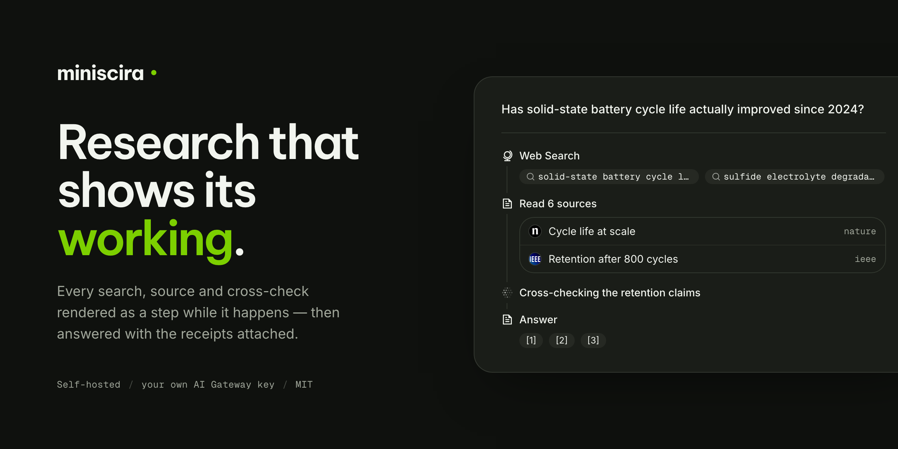

# MiniScira



An AI research assistant that shows its working. Ask a question and a durable
backend agent searches the web, reads sources, and answers with inline
citations — with every search, page read and delegated sub-agent rendered as a
live step rather than a spinner.

Self-hosted, and each user brings their own AI Gateway key, so research is
billed to them rather than to whoever runs the deployment.

**[Documentation](https://miniscira.com/docs)** ·
[Architecture](https://miniscira.com/docs/architecture) ·
[Self-hosting](https://miniscira.com/docs/self-host)

## Stack

- **[eve](https://github.com/vercel/eve)** — durable backend agent framework
- **Next.js 16** + React 19 + **shadcn/ui** (Base UI) + Tailwind v4
- **[Streamdown](https://streamdown.ai)** — streaming markdown
- **[better-auth](https://better-auth.com)** — Vercel (default) + Google +
  GitHub + email/password
- **Neon Postgres** + **Drizzle ORM**
- **[Vercel AI Gateway](https://vercel.com/ai-gateway)** for models and
  reranking — no per-provider keys. Default model
  `xai/grok-4.20-reasoning`, compaction on `google/gemini-3.5-flash`; see
  `lib/models.ts` and `agent/agent.ts`.

## How it fits together

Two processes that behave like one. `withEve()` in `next.config.ts` rewrites
`/eve/v1/*` to the agent, so from the browser there is a single origin and no
CORS.

```
Browser ──────▶ Next.js :3000 ──────▶ Postgres
                      │
                      │ /eve/v1/*  (rewrite)
                      ▼
                eve agent :4274 ────▶ Postgres
                      └──────────────▶ AI Gateway
```

On Vercel both deploy as one project. Everywhere else you start both yourself —
`next build` does **not** build the agent.

| Path | What lives there |
| --- | --- |
| `agent/` | Everything the model can see or do: tools, skills, instructions, subagents, schedules |
| `agent/channels/eve.ts` | The agent's HTTP channel and its ordered auth chain |
| `app/(app)/` | The authenticated shell — chat, projects, lookouts, settings, MCP |
| `app/api/` | REST endpoints the UI calls directly |
| `app/docs/` | The documentation site, built with Fumadocs |
| `components/timeline/` | The research transcript |
| `lib/` | Database, auth, retrieval, model catalog, event parsing |
| `proxy.ts` | Next 16's renamed middleware |

## Running it

You need [Bun](https://bun.sh), a [Neon](https://neon.tech) database, and a
[Vercel AI Gateway](https://vercel.com/ai-gateway) key.

```bash
bun install
cp .env.example .env.local
```

Fill in `AI_GATEWAY_API_KEY`, `DATABASE_URL` and `BETTER_AUTH_SECRET` — the only
hard requirements — and set `ALLOW_SHARED_GATEWAY_KEY=true` for local
development. Then:

```bash
bun run db:setup   # creates the pgvector extension, once per database
bun run db:push    # applies the schema
bun run dev        # starts Next.js and the agent together
```

Everything else degrades gracefully when unset: Exa, Firecrawl, Resend, Blob
storage and the OAuth providers. See
[the environment matrix](https://miniscira.com/docs/self-host#environment-variables)
for what each one buys you.

## Deploying

Vercel, Docker and a plain VPS are all covered in
[the self-hosting docs](https://miniscira.com/docs/self-host), including the
parts that bite — the two-process model, the `NODE_ENV` requirement on the agent
process, and why the Docker image has to be `linux/amd64`.

Set `DEMO_MODE=true` to serve a landing page instead of the app; that is what
miniscira.com runs.

### Quickstart: Docker Compose

The repo ships a complete self-hosted stack — app image, bundled Postgres +
pgvector, a one-shot migration service, named volumes and healthchecks:

```bash
git clone <this-repo> && cd miniscira
cp .env.example .env         # fill in the REQUIRED values (below)
docker compose up -d --build
docker compose --profile migrate run --rm migrate   # apply schema once
curl http://localhost:3000/api/health               # {"ok":true}
```

REQUIRED in `.env`: `DATABASE_URL` (or the bundled `db` service),
`AI_GATEWAY_BASE_URL` (any OpenAI-compatible endpoint — every model call goes
through it, with no fallback), `BETTER_AUTH_SECRET`
(`openssl rand -base64 32`), and `POSTGRES_PASSWORD` (must match
`DATABASE_URL`). Everything else is optional; `.env.example` is the full
matrix.

Normal startup never mutates the schema — apply committed migrations with the
one-shot `migrate` service, and pre-existing databases are adopted by
baseline-stamping (no DDL). The live gateway `/v1/models` catalog is the
authority for which models exist; `DEFAULT_CHAT_MODEL` and `AI_MODELS_JSON`
only steer defaults and display metadata.

Backups, restore, upgrades, rollback, health semantics, secrets, reverse
proxying and troubleshooting: see **[docs/DEPLOYMENT.md](docs/DEPLOYMENT.md)**.

## Contributing

See [CONTRIBUTING.md](CONTRIBUTING.md), and [SECURITY.md](SECURITY.md) for
reporting a vulnerability. `AGENTS.md` documents the invariants that aren't
visible from the code alone — worth reading before changing the agent channel,
the event parser, or the lookout scheduler.

## License

[MIT](LICENSE)
